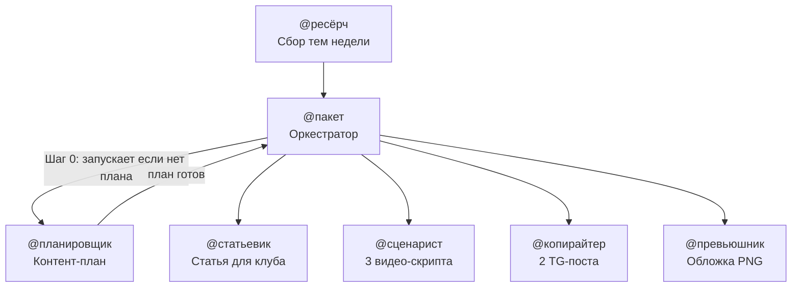

# Marketing Content Agent Kit

Мульти-агентная система для создания контента маркетингового агентства, работающая нативно в [Cursor](https://cursor.sh).

Один запуск `@пакет` → 8 готовых файлов: статья для закрытого клуба клиентов, 3 видео-сценария, обложка, 2 Telegram-поста.

---

## Как устроена система



---

## Агенты

| Агент | Вызов | Что делает | Выходной файл |
|-------|-------|------------|---------------|
| **@ресёрч** | `@ресёрч` | Обходит Reddit, YouTube, Twitter/X, TikTok; собирает маркетинговые темы и кейсы; оценивает применимость для РФ | `02_Контент/ресёрч/ГГГГ-НН-схемы.md` |
| **@пакет** | `@пакет с планом` | Оркестратор: вызывает @планировщик, затем запускает все агенты последовательно | 8 файлов за один запуск |
| **@планировщик** | `@планировщик` | Читает файл ресёрча, выбирает тему недели, формирует контент-план по дням | `02_Контент/планы/ГГГГ-НН-план.md` |
| **@статьевик** | `@статьевик` | Пишет статью 2 000–4 000 слов в разговорном стиле, структура 8 частей | `02_Контент/статьи/ГГГГ-ММ-ДД_суть-темы.md` |
| **@сценарист** | `@сценарист` | Сценарии: YouTube-лонг, Shorts, TikTok — таблица тайминг / речь / визуал / звук | `02_Контент/сценарии/ГГГГ-ММ-ДД_<тема-kebab>.md` |
| **@копирайтер** | `@копирайтер` | Пишет тизер в открытый канал и анонс в закрытый клуб | `02_Контент/посты/ГГГГ-ММ-ДД_суть_open.md` и `…_суть_club.md` |
| **@превьюшник** | `@превьюшник` | Генерирует обложку видео (PNG) через AI и текстовое ТЗ для дизайнера | `02_Контент/превью/ГГГГ-ММ-ДД_<тема-kebab>.png` (+ `_tz.md`) |
| **@уборщик** | `@уборщик` | Наводит порядок в папках: структура по смыслу, дедупликация, единые имена | — |

---

## Структура папок

```
agent-kit/
├── .cursor/
│   ├── skills/               ← алгоритмы агентов (Cursor подхватывает автоматически)
│   │   ├── копирайтер/SKILL.md
│   │   ├── пакет/SKILL.md
│   │   ├── планировщик/SKILL.md
│   │   ├── превьюшник/SKILL.md
│   │   ├── ресёрч/SKILL.md
│   │   ├── статьевик/SKILL.md
│   │   ├── сценарист/SKILL.md
│   │   └── file-cleaner/SKILL.md
│   └── lessons-template.md   ← шаблон долгосрочной памяти агентов
│
├── 01_Агенты/                ← контекст, примеры и логи каждого агента
│   ├── Копирайтер/
│   │   ├── README.md
│   │   └── _КОНТЕКСТ/примеры/    ← эталонные посты для обучения агента
│   ├── планировщик/
│   │   ├── README.md
│   │   └── _КОНТЕКСТ/
│   │       ├── шаблон-плана.md
│   │       └── архив-схем.md     ← история вышедших тем (авто-обновляется)
│   ├── ресёрч/
│   │   ├── README.md
│   │   └── _КОНТЕКСТ/
│   │       ├── источники.md      ← редактируй под свои источники
│   │       └── шаблон-выпуска.md
│   ├── статьевик/
│   │   ├── README.md
│   │   └── _КОНТЕКСТ/
│   │       ├── эталон-стиля.md
│   │       └── примеры/          ← эталонные статьи
│   ├── сценарист/
│   │   ├── README.md
│   │   └── _КОНТЕКСТ/примеры/    ← эталонные сценарии
│   ├── пакет/
│   │   ├── README.md
│   │   └── _ЛОГИ/
│   ├── превьюшник/
│   │   ├── README.md
│   │   └── _ЛОГИ/
│   └── уборщик/
│       ├── README.md
│       ├── _КОНТЕКСТ/примеры/    ← успешные кейсы уборки
│       └── _ЛОГИ/
│
└── 02_Контент/                   ← готовые результаты (рядом с 01_Агенты, не внутри него)
    ├── посты/                    ← TG-посты (@копирайтер)
    ├── статьи/                   ← статьи для закрытого клуба (@статьевик)
    ├── сценарии/                 ← скрипты для видео (@сценарист)
    ├── превью/                   ← обложки PNG + ТЗ (@превьюшник)
    ├── планы/                    ← контент-планы по неделям (@планировщик)
    └── ресёрч/                   ← отчёты ресёрча (@ресёрч)
```

Все агенты сохраняют результаты в папку **`02_Контент/`** — она уже включена в репо (с `.gitkeep` в подпапках). После работы агентов файлы появятся там автоматически.

---

## Быстрый старт

### Шаг 1 — Клонировать и открыть в Cursor

```bash
git clone https://github.com/your-username/agent-kit.git
```

Открыть папку `agent-kit/` в Cursor **как корень workspace** — тогда пути `01_Агенты/…` и `02_Контент/…` в скиллах совпадут с деревом проекта. Скиллы из `.cursor/skills/` подхватятся автоматически.

### Шаг 2 — Настроить источники ресёрча

Открыть [`01_Агенты/ресёрч/_КОНТЕКСТ/источники.md`](01_Агенты/ресёрч/_КОНТЕКСТ/источники.md) и указать свои сабреддиты, YouTube-каналы и поисковые запросы под нишу агентства.

### Шаг 3 — Запустить ресёрч

Написать в чат Cursor:

```
@ресёрч
```

Агент обойдёт источники, заполнит карточки тем, проставит вердикты (✅ Брать / ⚠️ Адаптировать / ❌ Пропустить) и сохранит файл `02_Контент/ресёрч/ГГГГ-НН-схемы.md` (имя `…-схемы.md` — историческое, внутри только маркетинговые темы).

### Шаг 4 — Запустить полный пакет

```
@пакет с планом
```

Агент сам вызовет `@планировщик`, выберет тему недели, сформирует план — и последовательно запустит все остальные агенты. На выходе 8 файлов.

---

## Адаптация под свой проект

| Что менять | Где |
|------------|-----|
| Источники для ресёрча | `01_Агенты/ресёрч/_КОНТЕКСТ/источники.md` |
| Пути сохранения файлов | Секция «Папки» в каждом `SKILL.md` и папка `02_Контент/` (при переименовании — правь пути везде одинаково) |
| Стиль статей | `01_Агенты/статьевик/_КОНТЕКСТ/эталон-стиля.md` |
| Примеры хороших постов | `01_Агенты/Копирайтер/_КОНТЕКСТ/примеры/` |
| Долгосрочная память агентов | `.cursor/lessons.md` (создай по образцу `.cursor/lessons-template.md`) |
| Шаблон контент-плана | `01_Агенты/планировщик/_КОНТЕКСТ/шаблон-плана.md` |

---

## Требования

- [Cursor](https://cursor.sh) с поддержкой Agent Skills (`@` вызов скиллов)
- Модель с доступом к инструментам: web_search, GenerateImage (для @превьюшник)
- Cursor версии, поддерживающей `.cursor/skills/`

---

## Лицензия

MIT — используй, адаптируй, форкай.
